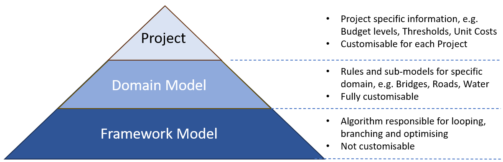
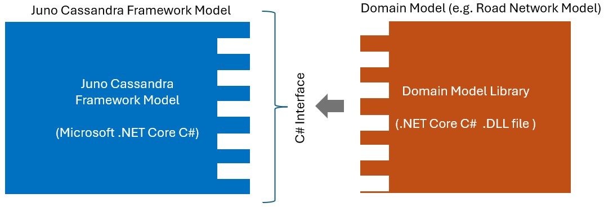
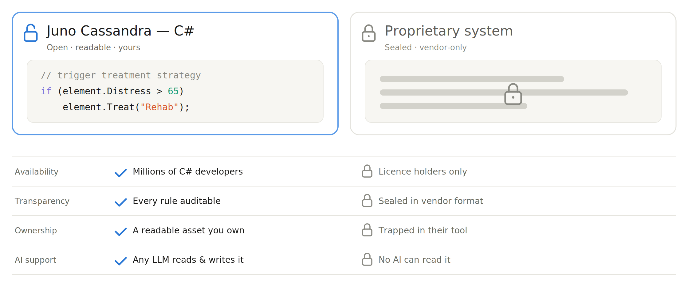

<!-- ------------------------------------------------------------------
     GENERATED FILE - DO NOT EDIT BY HAND.

     Mirrored from the Juno Cassandra documentation source:

       jcass_docs2\intro\model-levels.qmd

     by cassandra_main\scripts\assistant\sync-framework-concepts.ps1

     The sync is ONE-WAY. Any edit made here is lost the next time that
     script runs, without warning and without a merge conflict. To change
     what this page says, change the .qmd in the jcass_docs2 repository
     and re-run the sync.
     ------------------------------------------------------------------ -->

> **Read this when:** You need the vocabulary for what sits where — what a *project* is, and how the framework model and the domain model relate.

# Model Hierarchy

## Overview

Conceptually, you can think of Juno Cassandra as operating on three levels, as shown in the figure below. Each of the three levels are described in more detail in the following paragraphs.

> **Note**
>
> In the broader IDM context, the word 'model' and also 'deterioration model' can refer to many things. Also, there is some overlap between the use of the word 'model' and 'algorithm'. In this documentation, we will try to differentiate specifically between two types or levels of models. These are:
>
> 1.  The Framework model
> 2.  The Domain model

## The Project Level

Whenever you run a *Cassandra* model, you will be operating in the context of a *Project*. In Juno Cassandra, a project refers to the task of running a deterioration model on a specific client (i.e. infrastructure network) and for a specific domain model.

For example, when you run a Cassandra Infrastructure Deterioration Model (IDM) for a specific Road Network called network "Council ABC" then that is a project. If you run a Cassandra IDM for the same council's Bridge Network, then that will be another project. 

It is helpful to understand the Project Context by thinking in terms of folders on your desktop computer. Typically, you will want to use a Cassandra project folder only for files related to Juno Cassandra. If, for example, you have many pre-processing files such as supporting documentation, then we recommend you create a sibling folder under the same parent folder, and keep your non-Cassandra-specific files in there.

## The Domain Model

In the context of Infrastructure Deterioration Models (IDM), a domain model is a set of rules, triggers and thresholds that pertain to a specific type of infrastructure. Examples of domain-specific models include:

-   Bridge Management System models.
-   Road Network models.
-   Water Network models.
-   Rail Network models.

A domain model will normally be designed, tested and calibrated by engineers familiar with the specific domain. For example, a road network model will be coded and managed by engineers with experience in road networks, while a water network model will be designed and managed by engineers with a background in water/pipe systems.

In Juno Cassandra, a user can design and build their own Domain Model using their domain knowledge. Typically, such models will include features to allow for the specific policies and preferences of a specific client or network.

Within a Domain Model, you will typically find sub-models that define aspects such as how fast elements will deteriorate, what the impact of certain treatments are etc. Examples of domain sub-models include the World Bank HDM models for road rutting and roughness development etc. (Paterson 1987).

In Juno Cassandra you have freedom to implement the domain sub-models of your choosing. Your domain sub-models can range from traditional regression equations or lookup tables right to Machine Learning models using Random Forests for making more accurate predictions.

Although you can design your domain model in any way you want, for a domain model to link to Juno Cassandra's Framework Model, the model should implement a specific [software interface](https://en.wikipedia.org/wiki/Interface_(computing)). 

The key requirement of a Domain Model interface is that it needs instructions or functions to direct each of the following five model stages:

1.  Initialisation.
2.	Triggering treatment strategies; 
3.	Triggering Routine Maintenance where needed (if no treatment selected);
4.	Resetting condition when a treatment or maintenance has been applied; and
5.	Incrementing/deteriorating condition if a treatment had not been applied.

More information about these stages can be [found at this page](03-execution-stages.md#model-key-stages).

## The Framework Model

The Cassandra **Framework Model**, which we will refer to as the 'framework model', refers to the algorithmic engine that executes a certain procedure over all modelling periods. The framework model refers to compiled software provided by Lonrix Ltd.

The framework model is responsible for structuring and executing the looping over all model elements, detecting when to apply treatments (resets) and when to increment condition (deteriorate), when to trigger and apply routine maintenance and so forth.

The framework model is domain agnostic whereas the domain model, as the name implies, is specific to an engineering domain such as road networks, bridge networks etc. For a more detailed discussion of the elements of the Framework Model, please [see this link](02-framework-model.md#framework-mod).

## Linking Framework and Domain Models

When you define and code your Domain Model, you are essentially customising the Juno Cassandra framework to do things the way you want it to be done. To create your own Domain Model, you need to use a tool such as Microsoft Visual Studio to create a .NET Core Library using the C# programming language. The library you create must implement the required interface methods to couple it with the Framework Model at runtime, as shown in Figure 2 below.

To code or maintain your own Domain Model, you need to have intermediate level experience in programming .NET C# using Visual Studio. Alternatively, you can get Lonrix Ltd to work with you to develop a Domain Model customised for your needs, or you can hire your own programmer to do such programming. 

Either way, a good place to start would be to attend a training course that walks you through the key aspects involved in coding your own domain model. With respect to Road Network models, Lonrix has already developed a default Road Network model which we can make available to you to then modify to suit the specific needs of your network. This allows you to start from a working example and then extend that example as needed to suit your needs.

## Domain Model in C# .NET - Why?

The decision to require modellers to code their domain model in C# stemmed from 
many years of working with different approaches to allowing modellers to take
control of the details of their domain model.

Apart from providing optimal performance at run-time, the use of a precompiled 
.dll file for a domain model offers the highest level of access for debugging into
your domain model. Juno Cassandra provides a special tool that allows you to set
breakpoints in your domain model code, run the model, and then inspect variable 
values when those breakpoints are hit.

This means you have more control over your domain model at run time (in debug mode),
and a frustrating edge case in your model ("Why does element 123 not trigger a treatment
in period 6") can now be resolved by a modeller directly (assuming the modeller has the necessary skills and training).

> **Note**
>
> Coding in C# may be intimidating to the average Civil Engineer. However, by using a modern computer language such as C#, we open up near-infinite flexibility in what you can do with your Domain Model. Also, this approach means that you can find ample free learning resources and tools online - a much better approach than requiring you to learn a customised declaration of expressions specific to our software.

Since 2024, maintaining any code base has become much easier through the assistance
of Large Language Models. With skilled prompting of LLMs, a Civil Engineer with basic coding skills can now easily refine and maintain the relatively small code base required for even a sophisticated domain model.

Another key advantage of using the C# coding approach to building domain models is
that - with proper coding techniques and code comments - your code becomes a living
document for key decisions in your domain model. There is no longer a need to keep
a set of abstract function or expression codes and at the same time also a set of
documentation - likely to quickly become outdated as the function or expression set
is modified in the heat of an urgent project.

Closely related to the documentation advantage is the fact that your domain model
code is not locked up into a specific software vendor's data storage system. The
code is YOURS, if you wish to keep your domain model private, you can do so by
default. The advantages of such as coding approach over a vendor-specific coding
system is explained in the image below:

---

## References

- Paterson, W.D.O.. (1987). Road Deterioration and Maintenance Effects. Models for Planning and Management. Johns Hopkins University Press
