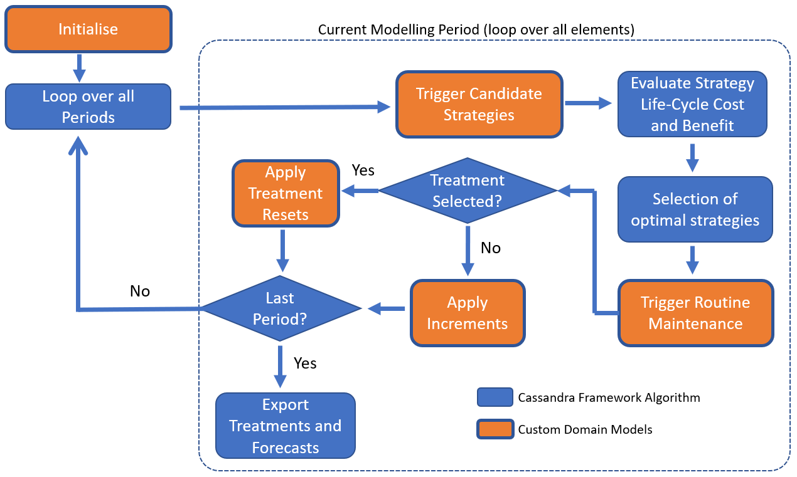
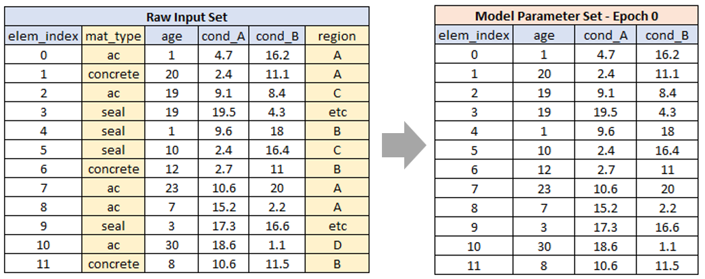

<!-- ------------------------------------------------------------------
     GENERATED FILE - DO NOT EDIT BY HAND.

     Mirrored from the Juno Cassandra documentation source:

       jcass_docs2\intro\framework-mod.qmd

     by cassandra_main\scripts\assistant\sync-framework-concepts.ps1

     The sync is ONE-WAY. Any edit made here is lost the next time that
     script runs, without warning and without a merge conflict. To change
     what this page says, change the .qmd in the jcass_docs2 repository
     and re-run the sync.
     ------------------------------------------------------------------ -->

> **Read this when:** You need to know which half of the work is yours. This is the framework/domain split, stage by stage.

# The Framework Model

## Approach Outline

In this section, we discuss the key aspects of the *Cassandra* framework model's approach to select and place treatments during the modelling period.

## Framework Model Outline

The figure below conceptually shows the key steps involved in Juno Cassandra's selection and optimisation of treatments. In this figure, tasks shown in blue are aspects handled by the *Cassandra* framework model. This code runs without any need for the user to customise or alter it.

The tasks shown in orange involve domain models as defined earlier. In each of these modules, 
the domain model handles the logic specific to the domain in question (e.g. specific trigger
conditions or specific equations to determine deterioration increments). As indicated
by the blue outline around the orange blocks - the framework model remains responsible
for calling the domain model elements at the correct stage of model execution.

> **Important**
>
> It is important to note that the image shown above is a generalised description
> of the framework model. Depending on which model type is being run, some steps may be omitted or - for some specialised models - additional steps not shown here may be executed. For a discussion on the different types of framework models available, [see this page](05-model-types.md). More types of framework models will be added over time.

## Parameter Data Initialisation

This task involves the population of the model parameter table for Epoch 0 (An *epoch* marks the end of a time period. [see this link](06-definitions.md#epochs) for more information). Figure 2 below shows a schematic example of what is involved in model initialisation:

As shown above, parameter initialisation mainly consists of extracting, from the 
raw input data the fields that represent the starting conditions for each model parameter. Here, by 'model parameter' we mean an aspect of a domain model such as element age. Here we differentiate between raw input data and model parameter data. These two key data components are
discussed in more detail in [this section](04-data-components.md#data-comps). 

Although the bulk of the work done in parameter initialisation will concern the extraction of data from the raw input data, other tasks may also have to be done during the initialisation stage. For example, you may have a Machine Learning (ML) model that predicts the likely service-life of a component. You may want to use this model during the initialisation stage to make a prediction and set the value in a corresponding model parameter so that the domain model can make use of it later on.

You may also want to create new parameter values from the raw data, as opposed to using the raw input data 'as-is'. For example, your raw input data may contain detailed material types (such as 'stainless steel', 'carbon-fibre', 'cast-iron' and 'PVC'), but you want your domain model to make decisions based on a more general classification such as 'metal', 'concrete' and 'other'. In such a case, your initialisation routine will most likely make use of lookup tables that you can define as part of your model setup file. 

**It is, however, strongly recommended that you do as much as possible of these types of data processing tasks in the pre-processing stage**, so that the fields you need to assign to parameters are pre-defined in your raw input data. This will move some complexity out of the (already complex) domain model into the pre-processing stage which means you can view and validate the input before the model run starts. 

## Trigger Candidate Strategies

In this step, the framework model will loop over all elements and pass into the domain model's trigger function the raw data as well as the model parameter data for the previous epoch. Your domain model should now consider these data and decide which treatments or strategies to put forward for the framework model to evaluate.

In a [Multi-Criteria Decision Analysis (MCDA) model](05-model-types.md#mcda-model), you trigger individual treatments to consider for the current year (as opposed to strategies). Here, instead of relying on an economic analysis to select optimal treatments, you rely on engineering judgement and *a-priori* knowledge of which treatments perform best economically in which scenarios. For modellers that want more control over treatment selection, yet still have an element of Multi-Objective Optimisation to select optimal treatments, the MCDA model is the preferred method of optimisation.

In a [Benefit-Cost Analysis model](05-model-types.md#bca-model), a "strategy" denotes a sequence of treatments to be placed at different times during the period over which the benefits and costs for each strategy should be evaluated. 

This evaluation period is called the 'lookahead' period and can be different from the modelling period. For example, you may want to evaluate and compare treatment strategies over a 15-year period even though your model will only run for 10 periods. This is not a problem - *Cassandra* will automatically do cost benefit evaluation over the lookahead period **in each modelling period**.

For more details about the BCA Model, [see this page](07-bca-model.md).

## Selection of Optimal Treatments - MCDA

If you are using a Multi-Criteria Decision Analysis (MCDA) model, triggered candidate treatments are evaluated using the Multi-Objective Optimisation by Ratio Analysis (MOORA) method. This is a highly flexible method that allows you to specify multiple objectives to be optimised. Here, you can include economic considerations such as cost, but also aspects such as condition, age and exogenous factors (e.g. element criticality, CO2 emission factions, etc.)

## Selection of Optimal Strategies - Benefit-Cost Analysis

As indicated earlier, the strategies put forward by the Domain Trigger model are evaluated using area-under-the-curve Cost-Benefit analysis. Once this evaluation is completed for each candidate strategy, *Cassandra* needs to pick the strategies that optimally satisfies the specified budget constraints. The set of picked strategies are then added into the treatment set and the available budget for the period is reduced accordingly.

To ensure optimal treatment selection based on Benefit-Cost data, *Cassandra* has different optimisation options. These are currently all heuristic techniques that rely on Incremental-Benefit-Cost analysis. 

For more details about the BCA Model, [see this page](07-bca-model.md).

## Trigger Routine Maintenance

After the optimal strategies for the current model period are picked, *Cassandra* scans all of the model elements not treated in the current period. These elements are then given to the Domain Trigger Model function to check whether routine maintenance is triggered. This function, which you can customise, will receive the raw input data and current model parameter values for the element.

Using this information, your maintenance model can then decide which, if any, routine maintenance is needed. Only one maintenance treatment can be picked for an element in a given period.

The Routine Maintenance trigger acts as a sweeper to check whether maintenance is needed for those elements which did not receive a treatment in the current year. Currently, triggered routine maintenance is prioritized using a simple ranking of the Objective Function (future versions of *Cassandra* may include a more sophisticated method for prioritising routine maintenance). Maintenance treatments are added for the current period until the available maintenance budget for the period is exhausted. 

## Reset or Increment

After selecting optimal strategies and routine maintenance, *Cassandra* evaluates each element in the following manner:

* For elements without any selected Treatment or Routine Maintenance in the current period, all model parameters are Incremented using the Domain Model's custom *Increment* function.
* For elements to which a Treatment or Routine maintenance has been assigned, relevant model parameters are Reset using the Domain Model's custom *Reset* function.

Your customised domain models that apply increments or resets can be as simple or complex as you need to make it. A simple approach could use lookup tables to select and apply increments, or you can code increments using equations such as those defined in the World Bank's HDM models (Paterson 1987). 

As mentioned in the Introduction, one of the key design objectives of the *Cassandra* framework was to ensure that modern Machine Learning models could also be used in the increment and reset functions. Similarly ML models trained on observed data can be utilised for the triggering of Routine Maintenance.

---

## References

- Paterson, W.D.O.. (1987). Road Deterioration and Maintenance Effects. Models for Planning and Management. Johns Hopkins University Press
