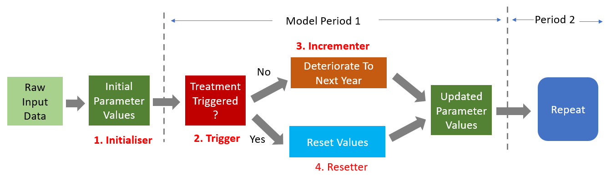

<!-- ------------------------------------------------------------------
     GENERATED FILE - DO NOT EDIT BY HAND.

     Mirrored from the Juno Cassandra documentation source:

       jcass_docs2\intro\model_stages.qmd

     by cassandra_main\scripts\assistant\sync-framework-concepts.ps1

     The sync is ONE-WAY. Any edit made here is lost the next time that
     script runs, without warning and without a merge conflict. To change
     what this page says, change the .qmd in the jcass_docs2 repository
     and re-run the sync.
     ------------------------------------------------------------------ -->

> **Read this when:** You are deciding which method a piece of logic belongs in. The stages map one-to-one onto the methods on `DomainModelBase`.

# Model Execution Stages

## Key Stages of Model Execution

The figure below conceptually shows the key stages or tasks that are executed at the heart of the IDM algorithm at the level of individual elements. While the various components shown in the figure may be executed in different orders or contexts for different model types, it is almost certain that all IDM models will include - somewhere in the process - the four key steps shown below.

The key stages of a model cycle within a period are:

1.  **Initialiser** Before the framework model steps over all modelling periods, the initial values need to be extracted and/or calculated from the raw data. It is the job of the domain model to instruct Cassandra which values need to be extracted and how they are to be modified (or not) before they are assigned to modelling parameters. The initial set created in this way forms the starting point for later periods.

2.  **Trigger** At the start of each modelling period, the domain model needs to decide which treatments are viable candidates to consider. HOW they will be considered depends on the framework model type, but - at the very least - your domain knowledge should be used to ensure than inappropriate treatments are not considered.

Once the preceding two steps are executed, the framework model will use some optimisation technique to determine which elements will be treated or not. The details of this decision will depend on the model type, but once the decision is made, the framework model will always need to execute ONE of these two steps:

3.  **Resetter** Reset Model Parameter Values: If a treatment has been selected, a function or set of functions need to be executed to 'apply the treatment'. In the context of an IDM, this means that one or more of the model parameters need to have their values reset to post-treatment levels. Your domain model is responsible for determining the exact rules and constants that drive these resets.

4.  **Incrementer** Increment Model Parameter Values: If a treatment has NOT been selected, a set of functions need to increment, or deteriorate, the values of one or more model parameters in order to reflect the change in condition during the period. The functions or equations that determine these increments again need to be specified in your domain model.

5.  In addition to the four stages shown in the above figure, Routine Maintenance also needs to be triggered and applied for each element and model period, but only after the above four cycles have completed.

In the above figure, the text shown in **bold red** represent four key functions (not showing the fifth function dealing with Routine Maintenance). In *Cassandra*, you need to code each of these four functions in C# and then provide *Cassandra* with the compiled code as a .DLL file at run-time.

Once you have these custom functions coded and compiled *Cassandra* will do the heavy lifting involved in cycling over elements, optimising on Benefit-Costs (BCA), or using Multi-Criteria Decision Analysis (MCDA), keeping track of treatments and budget balances etc.
