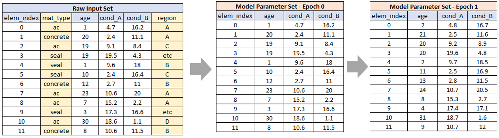
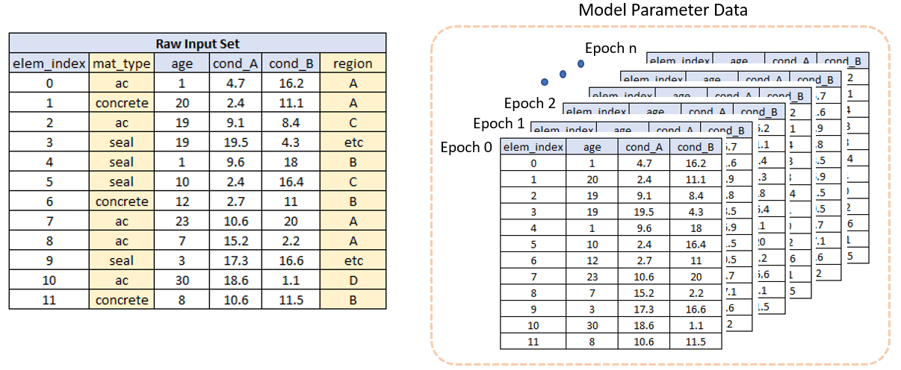

<!-- ------------------------------------------------------------------
     GENERATED FILE - DO NOT EDIT BY HAND.

     Mirrored from the Juno Cassandra documentation source:

       jcass_docs2\intro\model_data_comps.qmd

     by cassandra_main\scripts\assistant\sync-framework-concepts.ps1

     The sync is ONE-WAY. Any edit made here is lost the next time that
     script runs, without warning and without a merge conflict. To change
     what this page says, change the .qmd in the jcass_docs2 repository
     and re-run the sync.
     ------------------------------------------------------------------ -->

> **Read this when:** You are confusing raw input columns with model parameters, or wondering why a value you set does not persist between periods.

# Model Data Components

## Model Data Components

In a *Cassandra* model, we differentiate between two key data components:

1.  Raw input data; and
2.  Model Parameter data.

> **Note**
>
> Note that here we are referring to the data about the network in question that is used in the model run. Another level of data - not discussed here - is the setup or configuration data that is needed to define your Domain Model and constraints. Configuration Data will be discussed later sections of this documentation.

The raw input data defines the set of elements to include in the model and contains all the information needed to Initialise the model.

Figure 3 shows a simplified example that illustrates the relationship between these data components.

Key points to note in Figure 3 are:

- There is only one raw input set.
- There are many model parameter sets - one for each model period plus the Initial set mapping to Epoch 0; and
- The raw input set typically contains more information than the model parameter set.

**The *Cassandra* model never modifies the raw input set** - it only extracts values out of it. For this reason, the raw input data should ideally be 100% complete without missing values and without unexpected values.

As shown in the example, not all of the values in the raw data set are transferred to the model parameter set. For the example shown, only the 'age', 'cond_A' and 'cond_B' columns are initialised as model parameters, while columns "mat_type' and 'region' remain in the raw input set.

You should only create model parameters for fields that will change during the modelling period. This will make your model faster with less chance of errors occurring. For example, the region in which an element is, is unlikely to change. Therefore you keep this field in the raw data - your *Cassandra* model will have access to the raw data set during the run, so you can always extract - for a specific element - the raw data fields you need for your model to make decisions etc.

Figure 4 shows another way to understand raw input and model parameter data in *Cassandra*.

As shown in Figure 4, the model parameter data can be thought of as a three-dimensional array or matrix. Conceptually, within the *Cassandra* model, the data for a specific element, parameter and epoch can be retrieved as follows:

$$value = model.Data[ielem, iparam, iepoch]$$

Where:

- ielem is the zero-based index for the element.
- iparam is the zero-based index for the parameter.
- iepoch is the zero-based index for the epoch.

Model parameter indexes are determined based on the order in which they are listed in the model setup file. So, the first (topmost) model parameter has index zero, the second parameter has index 1 and so forth. Similarly, for elements, the first element in the raw input data is at index zero, the second element at index 1 etc.

Thus, conceptually, to retrieve the model parameter data for the element in input row 100, for the third parameter in the model setup file, and for epoch 3, Cassandra will use:

$$value = model.Data[99, 2, 3]$$
It is not needed for you to (yet) fully understand the above indexing system. Just take note that there are two data components, being raw input data and model parameter data, and take note of how they differ.
