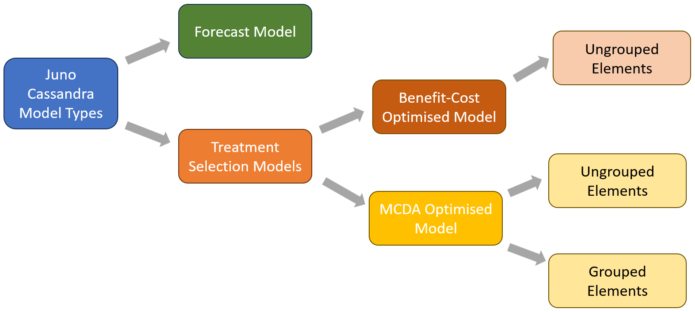

<!-- ------------------------------------------------------------------
     GENERATED FILE - DO NOT EDIT BY HAND.

     Mirrored from the Juno Cassandra documentation source:

       jcass_docs2\intro\model_types.qmd

     by cassandra_main\scripts\assistant\sync-framework-concepts.ps1

     The sync is ONE-WAY. Any edit made here is lost the next time that
     script runs, without warning and without a merge conflict. To change
     what this page says, change the .qmd in the jcass_docs2 repository
     and re-run the sync.
     ------------------------------------------------------------------ -->

> **Read this when:** You are starting a model and need to choose between an MCDA model, a BCA model and the Monte Carlo variants.

# Types of Models

## Overview

In Juno Cassandra, there are several model types you can run depending on your needs and the approach you want to take to the selection of interventions. The figure below illustrates the broad model types that are currently available in Juno Cassandra. Each of these model types are briefly described in the following sections. 

## Forecast Model

As the name suggests, a Forecast Model is a model which forecasts the condition of your network into the future. This model can be run with or without a set of Committed Treatments. 

A key feature that distinguishes this model from the other model types is that no triggering or selection of treatments is done. Instead, the model simply uses a set of treatments that you provide and then models the future condition of the network under this treatment plan. You can also run this model without any committed treatments.

Because no optimisation is performed with this model type, a Forecast Model typically runs fast compared to other model types. It is a good model to select when you have a Forward Works Plan developed in the field or through other software, and you want to check the likely future condition of your network under the planned treatment set.

## Treatment Selection Models

Treatment selection models are models that try to select an optimal set of treatments to suit a budget constraint or future condition target. Currently, in Juno Cassandra, there are two main approaches to treatment optimisation:

### Benefit-Cost Analysis Optimised Model

This model evaluates different treatment strategies over a specified look-ahead period using Benefit-Cost Analysis (BCA) principles. For each candidate strategy that is triggered, the model predicts the future values for a selected Objective Function parameter. The area-under-the-curve for the objective function is then calculated and compared to the area-under-the-curve for a Do-Nothing (i.e. Maintenance-Only) scenario which (optionally) involves only routine maintenance. 

The difference between the areas-under-the-curve for each candidate treatment strategy and the Do-Nothing (Maintenance-Only) scenario are then used to assign to each candidate strategy a 'Benefit-Compared-to-Do-Nothing'. This Benefit is used together with the Life-Cycle Costs over the look-ahead period to provide indicative Benefits and Costs that can be used for Benefit-Cost Analysis.

After the Benefits and Costs for each candidate strategy are calculated, an Optimisation algorithm is run to select a set of treatments that will maximise the benefit for the specified budget constraint. 

The complexity of the BCA model means that this model type can only be used for an un-grouped model type. That is, when network level optimisation is performed, elements are considered on an individual basis and there is no option to group elements (e.g. elements of a bridge).

For more details about the BCA Model, [see this page](07-bca-model.md).

### MCDA-Optimised Model

This model evaluates candidate treatments in a Multi-Criteria Decision Analysis (MCDA) approach. In this approach, candidate treatments for the current year are scored in terms of their suitability/appropriateness relative to the current element condition. 

These Treatment Suitability Scores, as well as the Treatment Costs, can then be used in addition to other criteria in a Multi-Criteria Decision Analysis to select an optimal mix of treatments to suit a complex set of criteria. 

Currently, Juno Cassandra uses the MOORA ('Multi-Objective Optimization by Ratio Analysis') implementation for MCDA analysis. Future versions may include options to use alternative methods to execute the MCDA analysis. For more information and discussion of the MOORA method, we suggest you study [this paper](https://www.ncbi.nlm.nih.gov/pmc/articles/PMC10861981/).

> **Note**
>
> The MCDA-model can be seen as more focused/steered by engineering judgement whilst the BCA-model is more economically focused. Both methods implement some form of network level optimisation to select an optimal mix of treatments given a set of candidate treatments or treatment strategies.

### Grouped and Un-Grouped Optimisation

For the MCDA-type models, there is an option to run the model using grouped or un-grouped elements. Grouped elements are useful for situations where elements can be logically grouped into a single unit, and where optimisation should consider such units rather than individual elements.

An example is a Bridge Management System in which the model elements represent bridge elements (e.g. trusses, spans, bearings etc.), all of which resort under a parent unit which is the bridge itself.

In such situations, you may typically want to assign treatments based on the condition of the Bridge rather than on the basis of individual elements. This approach of optimising based on the units rather than elements within units allows the model to ensure that all treatments applied to a bridge or similar unit will be **applied in the same period**.

Thus, with a grouped element model, you can avoid an outcome in which different elements on the same unit (e.g. bridge) are treated just one or two years apart, meaning different site establishment costs each time.

With a grouped model, a selected condition index for individual elements are first used in the Framework Model to get a statistic to represent each unit as a whole. The network level optimisation is then based on selecting which units to treat in a specific period. When a unit is selected for treatment, the treatments are applied to each element within the unit in the same period, even though the type of treatments may vary from one element to the next within the unit.

> **Important**
>
> It is important to note that, with a grouped model, although elements within a unit are always treated at the same time, the treatment types can still vary from one element to the next within a group based on the trigger methods and Treatment Suitability Scores. 
>
> It is also possible that some elements within a group are not treated at all if, based on your domain model, those elements are not ready for treatment. However, typically, a unit that has only a few elements that are 'ripe for treatment' will not be prime candidates for selection in the MCDA-optimisation algorithm.
