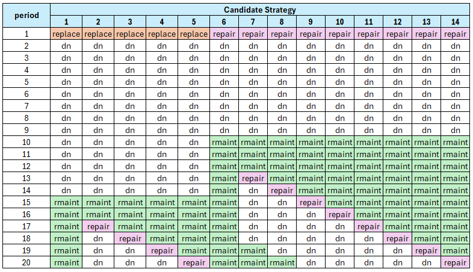
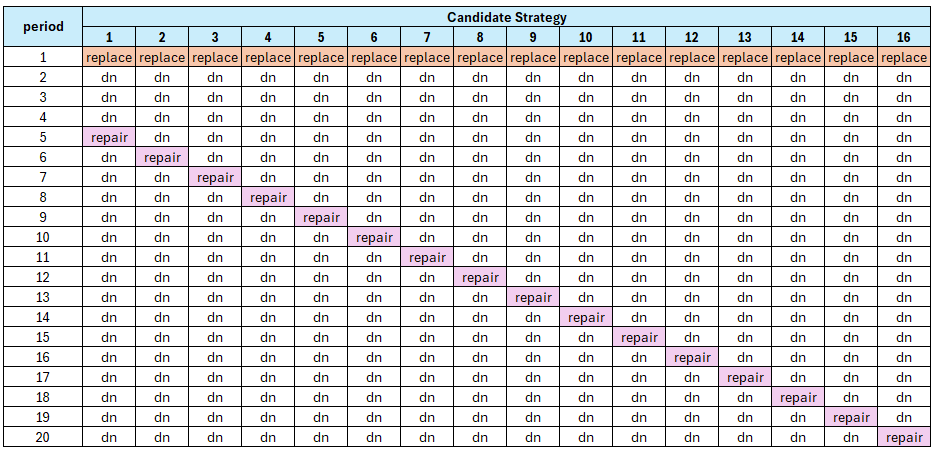
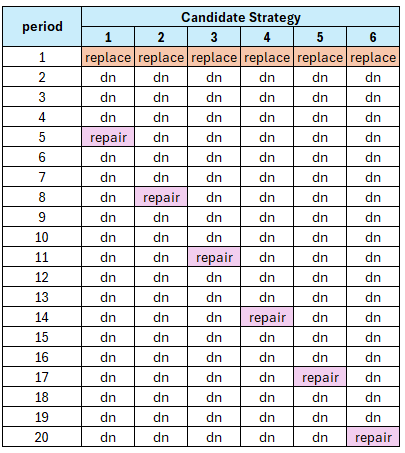
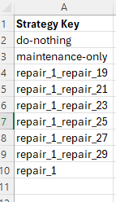
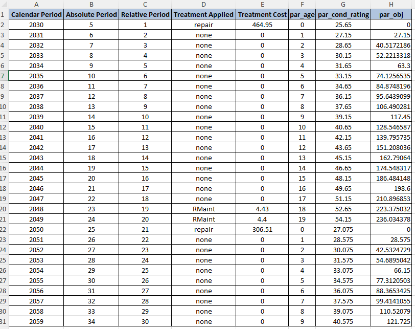
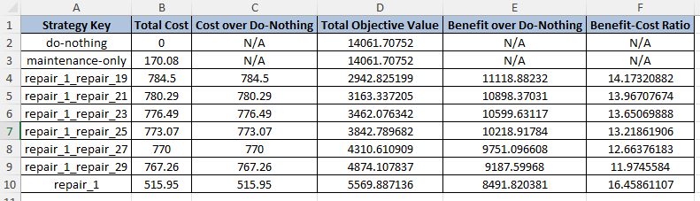
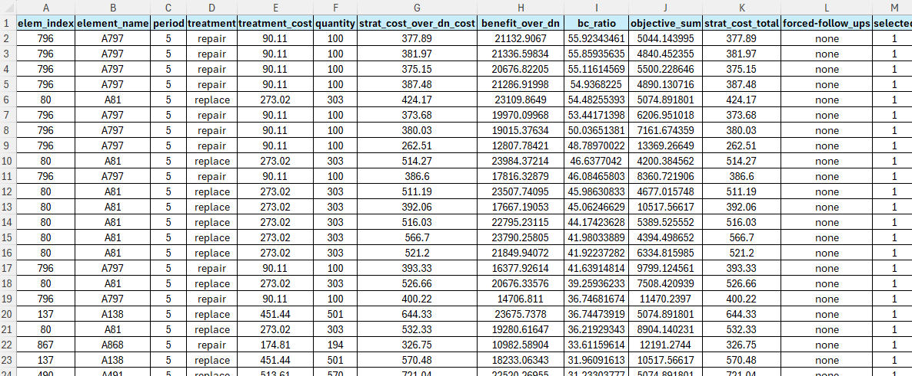

<!-- ------------------------------------------------------------------
     GENERATED FILE - DO NOT EDIT BY HAND.

     Mirrored from the Juno Cassandra documentation source:

       jcass_docs2\intro\bca_model.qmd

     by cassandra_main\scripts\assistant\sync-framework-concepts.ps1

     The sync is ONE-WAY. Any edit made here is lost the next time that
     script runs, without warning and without a merge conflict. To change
     what this page says, change the .qmd in the jcass_docs2 repository
     and re-run the sync.
     ------------------------------------------------------------------ -->

> **Read this when:** Your model triggers strategies rather than individual treatments, or you need to understand what the optimiser will do with what your trigger produces.

# BCA Model

## Overview

The Benefit-Cost Analysis (BCA) model uses a sophisticated optimisation based on Incremental-Benefit Cost Ratios of candidate strategies compared to either a 'Do-Nothing' scenario or a 'Maintenance-Only' scenario. In this context, 'maintenance' refers only to Routine Maintenance (as opposed to interventions such as 'Preserve', 'Rehabilitate', 'Replace' etc.).

It should be noted that - although the BCA model uses a more sophisticated approach to evaluate treatment suitability compared to condition, the simpler Multi-Criteria Decision Analysis (MCDA) model can provide comparable - and in some cases better - outcomes if the MCDA model is carefully crafted with Treatment Suitability Scores based on established domain knowledge.

## Objective Parameter

The basis for the BCA model is the definition of an Objective Parameter to minimise or maximise relative to either a 'Do-Nothing' scenario or a 'Maintenance-Only' scenario. You can define your own Objective Parameter in your domain model. You need to inform the model as to which model parameter is your Objective Parameter. This is done in the Model Configuration, and specifically the Setting 'Objective Parameter'.

The **Model Configuration** referred to throughout this page is the `configurations.xlsx` workbook that lives in your project's `inputs` folder. It carries one row per setting - a setting name and its value - and each of the settings named below is one of those rows. Juno Cassandra documents every available setting, its accepted values and its default, inside the application itself.

You can specify whether your Objective Function is to be minimised or maximised by modifying the Model Configuration setting 'Minimise BCA Objective' (if 'TRUE', then the Objective is minimised).

## BCA Strategy Generation

**In Juno Cassandra, a strategy is defined as a sequence of treatments separated by periods of 'do-nothing' or routine maintenance**. The BCA model requires the model to create - for each viable element - a set of candidate strategies. In a specific modelling period, candidate strategies are only generated on element for which one or more treatments have been triggered.

For each triggered treatment, Cassandra will use a recursive rollout algorithm in conjunction with the trigger logic in your domain model to create and evaluate all possible future treatment scenarios over the look-ahead period (specified in the Model Configuration by the setting **'Number of Look-Ahead Periods'**).

For example, if - for a specific element - your Domain Model triggers two candidate treatments 'replace' and 'repair' in period 1, then the rollout strategies may conceptually look as follows for a look-ahead period of 20:

In this example, 'dn' denotes 'do-nothing'. As you can see, the candidate treatment 'replace' applies enough of a reset to hold off routine maintenance ('rmaint') until period 15. One strategy is to persist with routine maintenance only, alternatively a 'repair' action triggered from period 17 can be applied in future periods 17, 18, 19 or 20.

## Follow-Up Treatments Not Forced

In Juno Cassandra, when a specific strategy is chosen to be applied for an element, **only the first treatment of the strategy is applied**. Follow up treatments are not applied. This is a design decision based on the fact that - at the point when strategies are chosen in say period 1, the model cannot know or evaluate what the full network will look like in say 15 years. 

A follow-up treatment in year 15 of a winning strategy evaluated in year 1 for a certain element may no longer be as attractive in year 15 when the rest of the network condition is taken into account by the model **at that stage**. Instead, in year 15, when the mnodel can estimate the full network condition, the same element will be evaluated again to determine candidate strategies and that element's strategies will compete against those of other elements again.

> **Important**
>
> Often you will have treatments in your Domain Model that you want to force into the program based on domain rules. For example, in a road network models you may want to always place a follow-up Chipseal a certain number of years after the Rehabilitation. 
>
> In such cases, you should use the Trigger function of your domain model to trigger that follow-up Chipseal at the right time, designing your model to check for the last treatment (is it a Rehabilitation?) and time elapsed since treatment. 
>
> **In addition, you should flag that follow up Chipseal as 'force' so that the model will do its best to force that follow-up treatment into the program before selecting additional treatments on other elements during the optimisation stage.**

## Preventing Combinatorial Explosion

Whenever your Domain Model triggers two or more candidate treatments in a period, there is a possibility that the number of candidate strategies may increase exponentially as the look-ahead period increases. If this type of '[combinatorial explosion](https://en.wikipedia.org/wiki/Combinatorial_explosion)' happens, the model will become unstable and the computer is likely to throw a Stack-Overflow error. 

With recursive rollout strategy generation, this danger of 'exploding strategy sets' can be guarded against in several ways:

### Framework Model Constraints

*Cassandra* will impose a hard limit of 200 candidate strategies per element during the analysis. If more than 200 candidate strategies are generated on any element, the model will throw an error. It is then your responsibility as modeller to constrain your Domain Model to reduce the number of potential strategies generated. The ways in which you can do this are discussed in the following paragraphs.

### Limit Triggered Treatments

Perhaps the most important measure to avoid combinatorial explosion of treatments is to ensure that your Domain Model limits the number of treatment candidates put forward for consideration. This can be done by using experience, coupled with thresholds, to avoid triggering non-viable treatments.

### Reduce the Look-Ahead Period

Always remember that - as the name suggests - evaluation of competing strategies in the look-ahead period is not an exact science. **Using look-ahead periods of 40 years into the future to select which treatments to do next is not realistic given the uncertainty involved in future projections**. We recommend you use a look-ahead period that allows you to evaluate the impact of treatments triggered in the current period plus perhaps one follow-up treatment. For domains such as road networks, this typically means 15 to 20 years maximum.

### Approximate Strategies

You should also take into account that BCA calculations are intended to find the best **strategy** to follow, and **not to pick the exact best periods in which to place all future treatments**. 

Let's say you have three catetories of treatment: (a) holding treatments; (b) preservation treatments; and (c) rehabilitations. You should then think of strategy evaluation as a process to allow you to decide - for each element - what is the best general approach to follow for this element. 

For example, viable strategies are:

* Holding, Holding, then Rehabilitate

versus:

* Rehabilitate, Preserve, Preserve

versus:

* Holding, Rehabilitate, Preserve

Note that the strategies are stated in general terms. Given the uncertainty of predictions we do not need to know **exactly** how long to wait between the first and second treatment - **we just need to get it approximately right**.

Consider a simple scenario where your Domain Model triggers 'replace' and then after 5 periods a 'repair' is triggered (for simplicity we will omit routine maintenance from this example, and we also assume only one follow up treatment is triggered). 

Since we can always postpone the 'repair' another year, all possible strategies may look as follows for a 20 year look ahead period:

Even for this simple scenario, rollout leads to 16 different strategies. But we could take a more approximate approach and consider the following - much more generalised - possibilities:

1. 'replace' followed by 'repair' within 8 years (say, after 5 years)

2. 'replace' followed by 'repair' within 12 years (say, after 10 years)

3. 'replace' followed by 'repair' within 12 to 15 years (say, after 15 years)

4. 'replace' followed by 'repair' at a much later stage (say, after 20 years)

Now we are evaluating candidate strategies in a more broad and appropriate sense given the uncertainty of predicted future condition. The above strategies will be clearly differentiated and BCA calculations allows us to select the best general approach and compare this with other strategies on competing elements.

In Juno Cassandra, you can achieve this generalisation by specifying the number of periods to skip between successive applications of the same treatment. This parameter can be specified in the Model Configuration with the setting **'BCA Strategy Periods to Skip'**.

If you set this configuration setting to 0, you will get the result shown in **Figure 2** above (no approximation applied). If you set this configuration setting to 3, you will get the result shown in Figure 3 below:

## Calculating Incremental Benefits

In a specific period, strategies are generated for all elements for which one or more candidate treatments are triggered by the Domain Model. In each case, a 'do-nothing' scenario and a 'maintenance-only' scenario is also calculated in which no treatments or only routine maintenance is considered, respectively.

Then, for each candidate strategy, the Benefit is calculated by taking the difference between the Objective Parameter sum (area under curve) and Cost - either relative to the 'do-nothing' scenario or relative to the 'maintenance-only' scenario.

You can control which of the 'do-nothing' or 'maintenance-only' scenarios are used by modifying the setting with key 'BCA Benefit Relative to Maintenance-Only' in the Model Configuration. If TRUE, Benefit and Cost is calculated relative to the 'maintenance-only' scenario. If FALSE, Benefit and Cost is calculated relative to the 'do-nothing' scenario.

### Calculating Benefit

Benefit for a specific strategy is calculated by first summing the Objective Parameter values over all look-ahead periods. This provides an approximation of the **Area-Under-the-Curve** of the Objective Parameter.

For a 'minimise' objective, the Objective Sum of each strategy is **subtracted** from the Objective Sum of either the 'do-nothing' or the 'maintenance-only' scenarios (depending on which are specified in the Configuration). For a 'maximise' objective, the opposite applies.

### Calculating Costs

Cost is calculated similar to Benefit, but here we always get the cost differential by subtracting the **total discounted cost** of all treatments for either the 'do-nothing' or 'maintenance-only' strategy from the total discounted cost of each candidate strategy. This 'cost-delta' is used to calculate the Benefit-Cost Ratio.

## Optimising Over All Strategies

At each period, all candidate strategies for all elements are combined. The combined strategy set is then put forward for optimisation under the budget constraint. This optimisation uses Incremental Benefit-Cost calculation to pick the best overall set of strategies.

Currently there are three different methods of optimisation that can be selected for optimisation in the BCA model. The method to use can be specified by the setting with key **'BCA-Optimisation Method'** in Model Configuration.

There are three options:

* **'bca-greedy'**: Benefit-Cost Analysis optimisation using the Bottom-Up Greedy algorithm

* **'bca-egal'**: Benefit-Cost Analysis optimisation using the Bottom-Up Egalitarian algorithm

* **'bca-ibcr'**: Benefit-Cost Analysis optimisation using the Bottom-Up decreasing Incremenal Cost Benefit algorithm

For more information on the differences between the available options, please [see this video on the Lonrix YouTube channel](https://www.youtube.com/watch?v=xLgGgbRXbsc&list=PLD-Z4S2CnydmJZet33t0EKed-f9thhk6u) and the three linked videos that follow on this one.

## Debugging Tools

The generation of strategies and the optimisation in the BCA model are relatively complex and can be seen as a 'black-box' which sometimes yield results that are difficult to comprehend. 

To make results more transparent, we have developed debugging tools that will allow you to peek into the model calculations during a model run. There are four tools available, all of which will export a set of information during a model run that can then be viewed to better understand the calculation process. 

### Debugging Strategy Generation

The first tool is aimed at exporting shorthand keys to summarise all candidate strategies generated for a specific element during a specific period. An example of the output from this feature is shown below:

This allows you to check whether all of the strategies that you expect for the specified element are being generated.

To use this debug feature, you need to specify the element and period for which to export debug strategies. You do this by specifying values for the following two keys in the Model Configuration:

* *Strategy Debug Element Index*

* *Strategy Debug Period*

### Debug Strategy Details

With the Strategy Detail debug export, you can drill into the details all of the strategies for the specified element. There are two outputs for detailed strategy debugging. The first will export a spreadsheet that will show, on separate sheets, details of all model parameters and treatments for each of the candidate strategies. Below is an example of a sheet that shows details for a specific strategy:

The second output will export a spreadsheet that shows a summary of the Benefit and Cost calculations for each strategy. This looks as follows:

### Debug Strategy List

The final debugging tool allows you to view BCA information for all strategies put forward in a specific period. There is also a flag to show you which strategies were picked by the optimisation algorithm. 
The output from this debug feature is a CSV file. The figure below shows a snippet of an example output:

